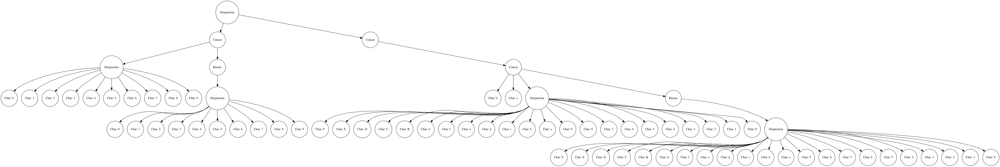
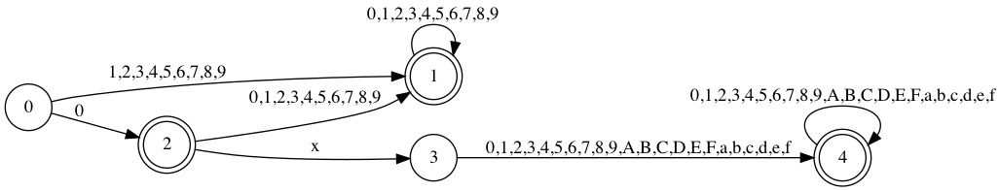

# ParserGen

[](https://github.com/monellz/ParserGen/actions)

Parser Generator

## Feature

-   [x] Generate regex AST as dot file
-   [x] Generate dfs for regex as dot file
-   [ ] Generate parser

## Usage

### dot_gen

```bash
./dot_gen --help                                       
Usage: Dot Generator [options] 

Optional arguments:
-h --help       shows help message and exits
-v --version    prints version information and exits
-r --regex      regex with double quotes[Required]
-v --verbose    increase output verbosity
-t --type       generate type [ast, dfa] default: dfa
-o --output     speficy output file(*.dot) default: stdout
```

*   ```./dot_gen -r "\d+|(0x[0-9a-fA-F]+)" -t ast -o ast.dot```

    

*   ```./dot_gen -r "\d+|(0x[0-9a-fA-F]+)" -t dfa -o dfa.dot```

    